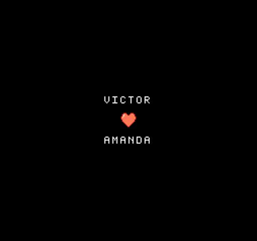
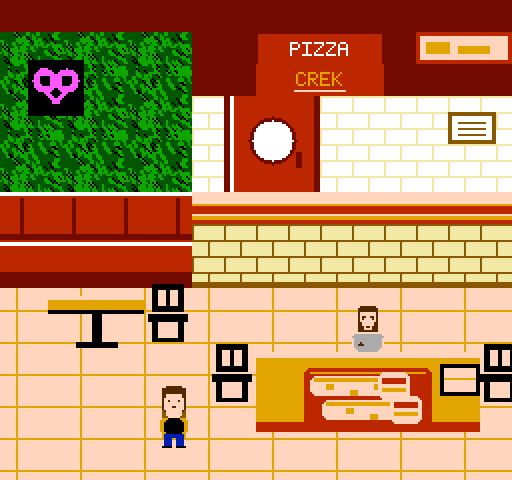
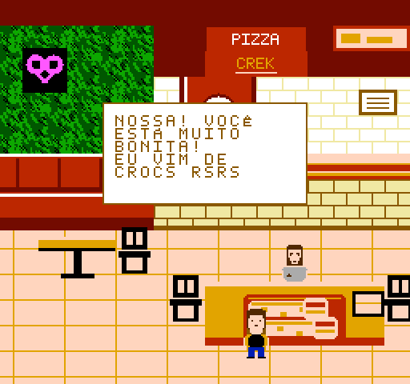
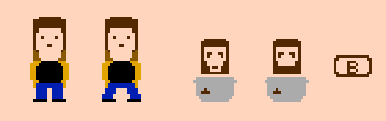

# Victor & Amanda — dois anos

Um jogo de NES escrito do zero em assembly 6502, de presente de dois anos de
namoro. Gera um `.nes` de verdade: roda em emulador e em console original,
via flash cart.



A Amanda anda pela pizzaria onde a gente se conheceu, chega na mesa onde eu
estou sentado, e conversa comigo.




## Jogar

Baixe [`jogo.nes`](jogo.nes) e abra em qualquer emulador de NES, ou grave num
flash cart e rode no console.

| tecla (fceux) | no NES | o que faz |
|---|---|---|
| Enter | START | entra na pizzaria / volta ao título |
| ← → | direcional | anda |
| D | B | fala com o Victor, quando o aviso aparecer |

## Compilar

Precisa de [cc65](https://cc65.github.io/) e Python 3 com Pillow.

```bash
brew install cc65
make            # gera jogo.nes
make test       # roda a ROM num emulador proprio e confere tudo
make capturas   # desenha as telas em build/
make audio      # renderiza a musica e a fala em .wav
make rodar      # abre no fceux
```

## Como isto foi feito

Nada de editor de tiles ou tracker: **todo o conteúdo é gerado por scripts
Python**, e o assembly só o consome. Os gráficos são desenhados como arte
ASCII no código, a música é escrita em nomes de nota, e um emulador 6502
próprio verifica o resultado.

| arquivo | o que faz |
|---|---|
| `src/jogo.s` | o jogo: máquina de estados, controle, sprites, música, diálogo |
| `tools/make_chr.py` | fonte 5×7 e o coração da tela de título |
| `tools/make_scene.py` | a pizzaria, pintada pixel a pixel dentro das regras do NES |
| `tools/make_sprites.py` | Amanda, Victor sentado, boca falando, aviso "B", a pizza |
| `tools/make_jogo.py` | o cenario do minigame (ceu, chao e os digitos do placar) |
| `tools/make_song.py` | notas → períodos de 11 bits do APU |
| `tools/nesemu.py` | emulador 6502 + PPU/APU/mapper, usado pelos testes |
| `tools/apu.py` | sintetiza o som do APU e grava `.wav` |
| `tools/screenshot.py` | desenha fundo e sprites em PNG |
| `tools/midi.py` | leitor de MIDI, usado na investigação da música |
| `tools/test_*.py` | as verificações |
| `unrom.cfg` | mapa de memória do cartucho |



## O cartucho

UNROM (mapper 2): 128 KB de PRG em 8 bancos de 16 KB, e **CHR-RAM**.

O banco 7 fica fixo em `$C000` com todo o código. Os outros entram em `$8000`
conforme a tela. Como não há CHR-ROM, cada cena manda os próprios desenhos
para a memória de vídeo antes de aparecer — é isso que dá **256 tiles novos
por cena**, em vez de todas dividirem um conjunto só.

O código ocupa hoje ~2 KB do banco fixo, e os bancos 2 a 6 estão vazios:
sobram **80 KB**, ou cerca de 17 cenas a mais.

## Armadilhas do NES que apareceram aqui

Todas custaram um bug de verdade antes de virar linha de código.

- **Cor em blocos de 16×16.** Não se escolhe cor por pixel nem por tile. As
  juntas do piso ficavam *vermelhas* embaixo de uma mesa, porque naquele bloco
  o mesmo índice de cor apontava para outra paleta.
- **Vblank.** Só dá para escrever no vídeo enquanto o feixe volta ao topo. Por
  isso a música, o pulso do coração e o texto do balão moram todos no NMI, e
  cada quadro faz um pedacinho.
- **Conflito de barramento na UNROM.** O número do banco viaja pelo mesmo
  barramento que a leitura da ROM. Grava-se num endereço cujo conteúdo já é o
  número do banco, senão o chip recebe lixo.
- **Sujeira de paleta.** Depois de escrever numa paleta, o endereço do PPU fica
  apontando para dentro dela e o console usa aquela cor como fundo da tela.
- **OAM suja no boot.** A tabela de sprites vive dentro do PPU e nasce com
  lixo. Só o DMA a limpa, então ele precisa acontecer *antes* de acender a
  tela — em emulador ela costuma nascer zerada e o defeito não aparece.
- **Paleta por tile de sprite.** Cada tile de 8×8 escolhe a sua. É assim que o
  cabelo da Amanda escurece de cima para baixo e o jeans não vira blusa.
- **Alinhamento do balão de fala.** Colunas 8–23 e linhas 8–15 não são
  arbitrárias: só assim os blocos de atributo caem inteiros dentro da caixa e a
  paleta dela não vaza para o cenário.

## Música

Três vozes por música (arpejo/melodia na quadrada 1, harmonia na quadrada 2,
baixo no triângulo), e **duas músicas**: uma para o passeio pela pizzaria,
outra para o minigame. A engine é chamada uma vez por quadro no NMI e lê
pares (nota, duração); o envelope de decaimento é o que faz a nota soar
tocada, e não como órgão.

O **menu fica em silêncio**. Apertar START toca um "plin" (uma nota só, com
o próprio decaimento de hardware do APU) e leva pra pizzaria, onde começa a
**introdução de "Amanda" (Boston)** — G e C/G em arpejo sobre pedal de sol,
tirada de tablatura. Ao entrar no minigame das pizzas, a música troca para o
**refrão**, transcrito do MIDI oficial da música (que também deu o
andamento, 61 BPM). O MIDI não tem faixa de vocal, mas tem uma faixa de sax
alto que funciona como guia de melodia; o refrão em si foi achado comparando
um preview da faixa com a gravação, já que o arquivo não tem marcadores de
verso/refrão. (Uma versão anterior colava as duas partes num loop só, mas na
gravação real tem um verso inteiro entre
elas; emendadas direto soava como duas músicas coladas, então virou uma
troca de verdade em vez de um loop maior.)

## Créditos e limites

Código e arte originais sob licença MIT. "Amanda" é de Boston (Tom Scholz,
1986) e os direitos seguem com seus titulares; aqui há apenas uma transcrição
da harmonia da introdução, para arranjo pessoal. A recriação da Pizza Crek é
fan art, sem vínculo nem endosso da empresa. Veja [LICENSE](LICENSE).
